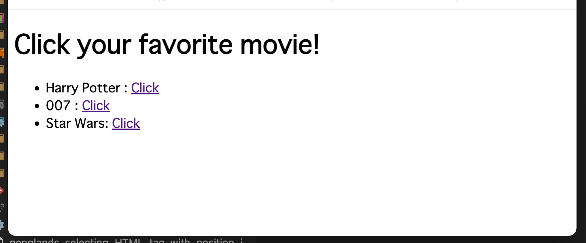
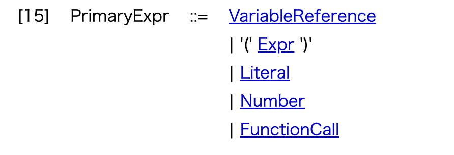

# Background

This project was developed to propose a solution to

- https://forum.katalon.com/t/index-number-using-test-object-attributes/62368/

Just open "Test Cases/TC1" and run it.


# Problem to solve

The target Web page looks like this:



See the HTML source: https://github.com/kazurayam/genglands_selecting_HTML_tag_with_position_index/blob/master/target.html

I want to click the 2nd <a> tag with the content text Click, which links to the movie “007”.

# Solution

See the source: https://github.com/kazurayam/genglands_selecting_HTML_tag_with_position_index/blob/master/Scripts/TC1/Script1645484417089.groovy

# Test Case in action

See how the sample project works

- https://drive.google.com/file/d/1JpRkIzfdesTHWJjgvURpsfWvAzxn-Uv1/view?usp=sharing

# Core key to solve

I wrote a XPath to select the 2nd anchor tag : 

```
(//a[text()='Click'])[2]
```

# Description

In the XPath expression, find a pair of `(` and `)` before `[2]`.

In the [XPath v1.0 Specification of W3C, 3.3 Node-sets](https://www.w3.org/TR/1999/REC-xpath-19991116/#node-sets), the Predicate prepended with a pair of `(` and `)` is described as **FilterExpr**.




# Conclusion

@gengland

I suppose that you just did not know how to use the pair of ( and ) to construct a FilterExpr in XPath. If you use it appropriately, you should be able solve your problem using XPath completely.

>Katalon Studio’s Recorder & Spy tools are ignorant of the FilterExpr either. But don’t blame them. It’s a Lightsaber   of XPath Jedis. Years of XPath experience required …

# By the way …

@Russ_Thomas

How would you solve this using CSS Selector?


